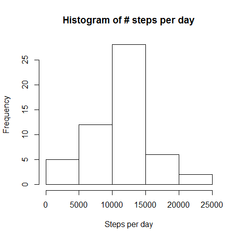
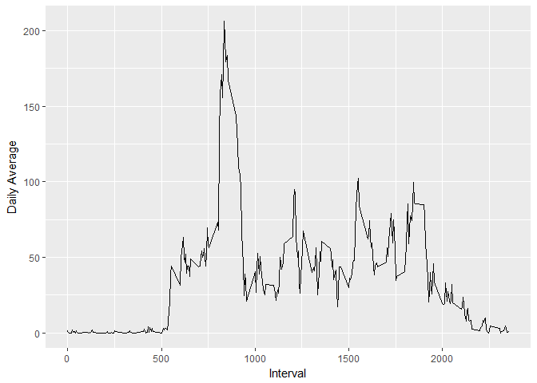
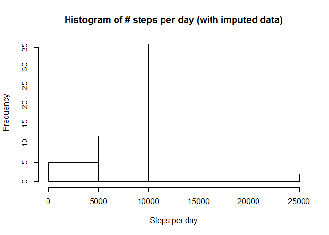
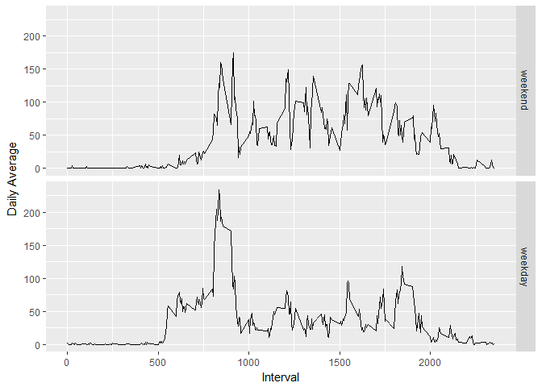

###Produced by Jacques du Plessis

###Load appropriate libraries

```r
library(dplyr)
```

```
## 
## Attaching package: 'dplyr'
```

```
## The following objects are masked from 'package:stats':
## 
##     filter, lag
```

```
## The following objects are masked from 'package:base':
## 
##     intersect, setdiff, setequal, union
```

```r
library(data.table)
```

```
## 
## Attaching package: 'data.table'
```

```
## The following objects are masked from 'package:dplyr':
## 
##     between, first, last
```

```r
library(ggplot2)
```

###Set global options

```r
options("scipen" = 999,"digits"=5)
knitr::opts_chunk$set(echo=TRUE) 
```

###Compute the Assignment date

```r
Assignmentdate <- format(as.Date("2018/03/25"),"%a %d %b %Y")
```

###The date is: Sun 25 Mar 2018


```r
## ----------------------------------------------------------------------------
## Date: 20180325
## Programmer: Jacques du Plessis
## Description: Reprodicible research - Week 2 - Course Project 1   
## Data Reference: 
## Package reference:  
## ----------------------------------------------------------------------------
```


## Loading and preprocessing the data

```r
unzip("activity.zip",overwrite = TRUE)
mydata <- read.csv("activity.csv")

##Remove the NA value with complete.cases
mydata_clean <- mydata[complete.cases(mydata),]
```


## What is mean total number of steps taken per day?

```r
## Cast data as pivot of date (day) and sum of steps
sumstepsperday_df <- dcast(as.data.frame(mydata_clean),
                           date ~ "Sum_steps",
                           value.var = "steps",fun=sum) 

## Histogram of number of steps per day
hist(sumstepsperday_df$Sum_steps,
     main="Histogram of # steps per day",
     xlab = "Steps per day")
```

<!-- -->

```r
## Compute the mean
mean_steps <- mean(sumstepsperday_df$Sum_steps)

## Compute the meadian
median_steps <- median(sumstepsperday_df$Sum_steps)
```
Mean steps per day is: 10766.18868  
Median steps per day is: 10765
  
  

## What is the average daily activity pattern?

```r
## Cast data as pivot of interval and mean of steps
Avg_steps_df <- dcast(as.data.frame(mydata_clean),
                      interval ~ "avg_steps",
                      value.var = "steps",fun=mean)

## Plot the results per Interval
ggplot(Avg_steps_df, aes(interval, avg_steps)) + 
    geom_line() + 
    xlab("Interval") + 
    ylab("Daily Average")
```

<!-- -->

```r
## Order the dataframe by avg steps decending
Avg_steps_df <-  setorder(Avg_steps_df,-avg_steps)
```
Interval: 835 contains the maximum average steps of: 
206.16981


## Imputing missing values

```r
## Report on the NA values
paste("There are:",sum(is.na(mydata)),"NA values in the dataset")
```

```
## [1] "There are: 2304 NA values in the dataset"
```

```r
paste("There are:",sum(is.na(mydata[,1])),"NA values in the steps column")
```

```
## [1] "There are: 2304 NA values in the steps column"
```

```r
impute_data <- mydata  

## Which records are ok
ok <- complete.cases(impute_data)  

## Impute missing values with the average of the 5-minute interval accorss all days
for (i in Avg_steps_df$interval) {
    ## Get the average for  this specific interval
    avg_for_interval <- Avg_steps_df[which(Avg_steps_df$interval==i),]$avg_steps 
    ## Replace NA's with the average of this interval accross all days
    impute_data[!ok,][which(impute_data[!ok,]$interval==i),]$steps <- avg_for_interval
}

## Check for NA again
paste("There are now:",sum(is.na(impute_data)),"NA values in the dataset")
```

```
## [1] "There are now: 0 NA values in the dataset"
```

```r
#Cast the sum of steps per day
sumstepsperday_df <- dcast(as.data.frame(impute_data),
                           date ~ "Sum_steps",
                           value.var = "steps",fun=sum)  


hist(sumstepsperday_df$Sum_steps,
          main="Histogram of # steps per day (with imputed data)",
          xlab = "Steps per day")
```

<!-- -->

```r
## Compute the mean
mean_steps_imp <- mean(sumstepsperday_df$Sum_steps)

## Compute the meadian
median_steps_imp <- median(sumstepsperday_df$Sum_steps)
```
Mean steps per day (with imputed data) is: 10766.18868  
Median steps per day (with imputed data) is: 10766.18868  
Difference in mean value between original and imputed datasets is: 0  
Difference in median value between original and imputed datasets is: 1.18868  


## Are there differences in activity patterns between weekdays and weekends?

```r
## Copy dataframe for manipulation
mydata_wd <-mydata_clean 

## Create vector with weekdays
myweekdays <- weekdays(as.Date(mydata_wd$date),abbreviate=TRUE)

#Set daytype as factor or myweekdays
mydata_wd$daytype <- factor(myweekdays %in% c("Sat","Sun"),
                            levels=c(TRUE, FALSE),
                            labels=c('weekend','weekday'))

#Cast data by weekday + interval
Avg_steps_df <- dcast(as.data.frame(mydata_wd),
                      daytype + interval~ "avg_steps",
                      value.var = "steps",
                      fun=mean)


ggplot(Avg_steps_df, aes(interval, avg_steps)) + 
    geom_line() + 
    facet_grid(daytype~.) + 
    xlab("Interval") + 
    ylab("Daily Average")
```

<!-- -->

Yes, activity patterns are different between weekdays and weekends.   
Weekdays have a higher peak early in the morning  
Weekends has more a more sustained level of activity during the day  

## The END . . .

